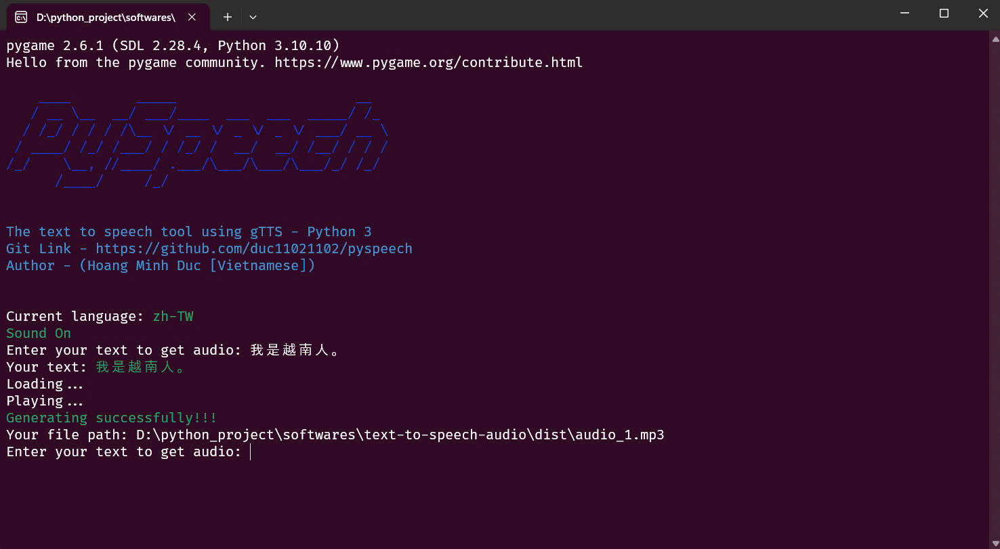

## PySpeech
You can create mp3 file with text and gTTS library (Google Translate's text-to-speech API)

<h4><p align="center"></p></h4>

```
What the program does? 

- Generate mp3 file with text
- Multilingual
- A terminal windows program
``` 

## Quick start 

<h4>The simplest method is to install the portable version using the .exe file, available at <a href="https://github.com/duc11021102/pyspeech/releases/download/v1.0/pyspeech.exe">this link</a>.
<br>
Or install with <b>python</b>:

### Requirements

* Python
* Python Libraries: `gTTS pygame pyinstaller colorama`

### Setup 

- Install the dependencies following these steps : 

  - Star this repository
  - <>Code > Download ZIP > Open cmd/terminal in that location
  - Run this command : `pip install -r requirements.txt`
  - Run `main.py`


- If you want to build and creat a .exe program:

  - Run this command : `pyinstaller --onefile --icon=icon.ico  tts-audio.py`
  - Your .exe file in your generated dist folder


### Command 
```/c``` - check current language

```/s``` - enable/disable automatic audio playback

```/*lang*``` - change language, default language is Chinese (Traditional), check <a href="https://github.com/duc11021102/pyspeech/releases/download/v1.0/pyspeech.exe" >this file<a/> to use

Example: ```/vi``` - change to Vietnamese

##  Plans for future
<ul>
  <li>Make add-on in Anki</li>
</ul>